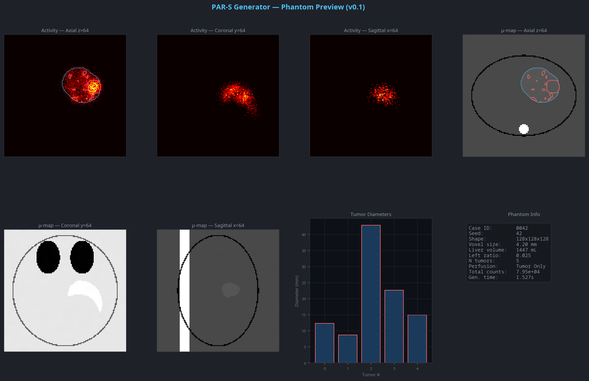

# PAR-S Generator

PAR-S Generator is a Windows desktop workflow for synthetic liver SPECT phantom generation and downstream SIMIND preparation.



## Current Workflow

The application now has two main workspaces in the left sidebar:

- `Generate`
- `Simulate`

The bottom-left utility area contains:

- `Settings`
- `About`

`Review` is no longer a standalone page. Batch monitoring is now part of `Generate`.

## What Changed in v0.3

- Task flow simplified to `Generate -> Simulate`
- `Generate` now contains two tabs:
  - `Preview`
  - `Batch Monitor`
- `Settings` moved to a dialog and `About` is now separate
- File-backed settings replaced unreliable `QSettings`
- UI language now supports `English`, `中文`, and `Français`
- `.a00` viewing now exists in one place only: `Simulate > SPECT Preview`
- Preview metrics now live in the fourth preview panel instead of a duplicated info block
- Left-lobe ratio is displayed as a true percentage, e.g. `0.35 -> 35.0%`

## Generate

`Generate` is the full phantom authoring workspace.

### Preview tab

Use it to:

- tune one phantom interactively
- inspect the 2D/3D preview
- validate configuration before long-running work
- define reproducible batch settings

The left side is organized into four parameter groups:

- `Volume`
- `Liver Geometry`
- `Tumors`
- `Activity`

Each group now follows the same interaction model:

- default mode uses sliders limited to recommended values
- `Advanced` unlocks manual control up to hard safety bounds
- tooltips explain each parameter in one sentence

### Important behavior

- Tumor size stays defined in physical `mm`
- Changing `matrix` or `voxel size` does not automatically rescale tumor diameter metadata
- Preview is for one case only and may force an `exact tumor count`
- Batch generation still uses `min/max tumors`
- Tumor morphology can be set to `Ellipsoid`, `Spiculated`, or `Random`
- Perfusion mode can be set to `Whole Liver`, `Tumor Only`, `Left Only`, `Right Only`, or `Random`

### Recommended volume presets

The default volume presets are:

- `96 / 5.89 mm`
- `128 / 4.42 mm`
- `160 / 3.54 mm`

These preserve roughly similar anatomic coverage while changing sampling density.

### Batch settings

The batch bar below the preview now contains:

- `Number of cases`
- `Use fixed seed`
- `Global seed`
- `Output directory`
- `Start Batch`

Reproducibility rule:

- Preview uses `case_id = 0`
- Batch uses `case_id = 1..N`
- When fixed seed is enabled, the seed is `global_seed + case_id`
- Preview does not consume the batch sequence

### Batch Monitor tab

This tab now owns the old review functionality:

- live progress
- ETA and elapsed time
- summary cards
- charts
- case table
- log panel
- load existing `batch_summary.json`

It does not contain the `.a00` viewer anymore.

## Simulate

`Simulate` is now the only place for SIMIND conversion and output inspection.

### Step 1: Raw Binary Export

- choose the source `case_*.npz` directory
- choose the raw binary output directory
- export all cases to:
  - `case_XXXX_act_av.bin`
  - `case_XXXX_atn_av.bin`

### Step 2: SIMIND Configuration

- configure `simind.exe`
- configure `.smc`
- configure the SIMIND output directory

### Step 3: Script or Run

- generate a `.bat` script
- or run SIMIND directly

### Step 4: Visual Check

The right-side viewer is now called `SPECT Preview`.

After a successful run, the first `.a00` file is loaded automatically for quick inspection.

## Validation Rules

The UI now blocks or warns before preview, batch, conversion, or SIMIND launch.

Blocked cases include:

- `Min tumors > Max tumors`
- `Contrast min > Contrast max`
- empty output directory
- invalid `simind.exe` or `.smc` path
- missing `case_*.npz`
- non-cubic volume
- bundled `ge870_czt.smc` used with unsupported geometry

Warnings include:

- parameters outside recommended ranges but still within hard safety bounds
- custom matrix/voxel settings that no longer match the bundled `ge870_czt.smc`

## Settings

Settings are stored in a JSON file instead of `QSettings`.

Default location:

- `%APPDATA%/PAR-S Generator/settings.json`

Stored items:

- default `simind.exe`
- default `.smc`
- default phantom output directory
- theme
- language
- auto-save batch config

If `Auto-save config on batch start` is enabled, the app writes:

- `last_batch_config.json`

into the selected batch output folder.

## Output Structure

### Phantom output

```text
output/syn3d/
├── case_0001.npz
├── case_0001_meta.json
├── case_0002.npz
└── batch_summary.json
```

### Raw binary export

```text
output/interfile/
├── case_0001_act_av.bin
├── case_0001_atn_av.bin
├── case_0002_act_av.bin
└── ...
```

### SIMIND output

```text
output/simind/
├── case_0001.a00
├── case_0001.h00
├── case_0001.res
└── ...
```

## Notes on `.smc`

The bundled `ge870_czt.smc` still assumes:

- `128 x 128 x 128`
- `4.42 mm`

If you change matrix or voxel size, you must use a compatible `.smc` file.

Photon histories are controlled by the selected `.smc` file, not by the UI.

## Tests

Core and workflow regression:

```bash
python -m pytest tests/test_phantom_anatomy.py tests/test_validation.py tests/test_workflow_state.py tests/test_ui_smoke.py -q
```

## License

MIT License. See [LICENSE](LICENSE).
