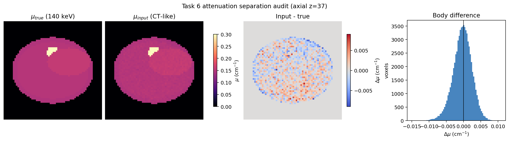

# PAR-S V2 Task 6 衰减图分离验证

- Profile: `population_tare_hcc_nopvi_v2`
- 总门禁: **PASS**
- 验证随机种子: `[101, 202, 303, 404, 505, 606, 707, 808]`

## 语义契约

| 用途 | 唯一允许的数组 | 单位 |
|---|---|---|
| 物理/SIMIND | `mu_true_140kev` | cm^-1 |
| 网络输入 | `mu_input_140kev` | cm^-1 |

## 观察结果

| 指标 | 结果 |
|---|---:|
| 体内 Input - True 均值 | -0.000335 cm⁻¹ |
| 体内 Input - True SD | 0.002712 cm⁻¹ |
| 体内 Input - True MAE | 0.002133 cm⁻¹ |
| 体内最大绝对差 | 0.015067 cm⁻¹ |

`mu_true_140kev` 在所有种子下字节级一致；`mu_input_140kev` 在 HU 域施加模糊、低频偏置与噪声后再转换为 μ，因此随种子变化，但不会反向污染真实物理图。

当前 CT 样退化参数明确标记为 **uncalibrated=true**；它是 Task 8 本地无 PHI 校准之前的保守工程占位，不应被表述为真实扫描仪噪声分布。

## 自动门禁

- [x] `mu_true_seed_invariant`
- [x] `mu_input_seed_sensitive`
- [x] `fat_mu_exact_0_146_cm1`
- [x] `true_and_input_float32`
- [x] `finite_and_nonnegative`
- [x] `outside_body_zero`
- [x] `ct_degradation_changes_input_only`
- [x] `ct_degradation_declared_uncalibrated`
- [x] `simind_selects_true_identity`
- [x] `simind_rejects_mu_input`
